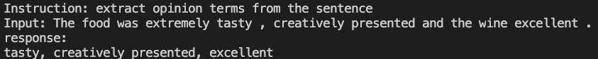
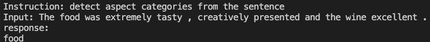
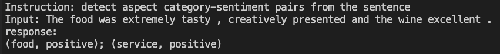

# chat-sentiment-analysis
Solve all sentiment analysis tasks by chat

## Prepare Finetuning Data
- chat_sentiment_analysis/prepare_data/process_asote_data.py
- chat_sentiment_analysis/prepare_data/process_acsa_data.py
- chat_sentiment_analysis/prepare_data/process_acos_data.py

## Step by Step
- [filetune](chat_sentiment_analysis/llama/finetune.py)
  - nohup sh run.sh chat_sentiment_analysis/llama/finetune.py > autodl.log 2>&1 &
- [inference_llama](chat_sentiment_analysis/llama/inference_llama.py)
  - sh run.sh chat_sentiment_analysis/llama/inference_llama.py
- [inference_alpaca_lora](chat_sentiment_analysis/llama/inference_alpaca_lora.py)
  - sh run.sh chat_sentiment_analysis/llama/inference_alpaca_lora.py
- [inference_gradio](chat_sentiment_analysis/llama/inference_gradio.py)
    - nohup sh run.sh chat_sentiment_analysis/llama/inference_gradio.py > inference_gradio.log 2>&1 &

## Supported Tasks
### Aspect Term Extraction
Instruction: extract aspect terms from the sentence

### Opinion Term Extraction
Instruction: extract opinion terms from the sentence

### Aspect Term-Opinion Term Pair Extraction
Instruction: extract aspect term-opinion term pairs from the sentence

### Aspect Term, Sentiment, Opinion Term Triplet Extraction
Instruction: extract aspect term, sentiment, opinion term triplets from the sentence

### Aspect Category Detection
Instruction: detect aspect categories from the sentence

### Aspect Category-Sentiment Pair Prediction
Instruction: detect aspect category-sentiment pairs from the sentence

### Try Chat-Sentiment Yourself

### Tips
- LLaMA-7b, GPU RAM 10G

## Reference
- [my-alpaca](https://github.com/l294265421/my-alpaca)
- [stanford_alpaca](https://github.com/tatsu-lab/stanford_alpaca#fine-tuning)
- [alpaca-lora](https://github.com/tloen/alpaca-lora)
