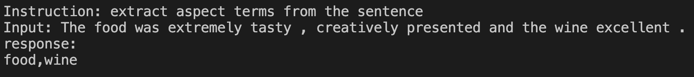
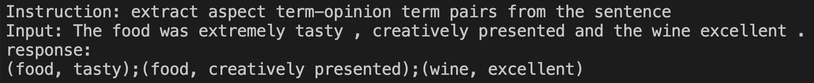
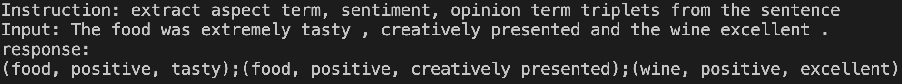

# chat-sentiment-analysis
Solve all sentiment analysis tasks by chat

## Step by Step
- [filetune](chat_sentiment_analysis/llama/finetune.py)
  - nohup sh run.sh chat_sentiment_analysis/llama/finetune.py > autodl.log 2>&1 &
- [inference_llama](chat_sentiment_analysis/llama/inference_llama.py)
  - sh run.sh chat_sentiment_analysis/llama/inference_llama.py
- [inference_alpaca_lora](chat_sentiment_analysis/llama/inference_alpaca_lora.py)
  - sh run.sh chat_sentiment_analysis/llama/inference_alpaca_lora.py
- [inference_gradio](chat_sentiment_analysis/llama/inference_gradio.py)
    - nohup sh run.sh chat_sentiment_analysis/llama/inference_gradio.py > inference_gradio.log 2>&1 &

## Supported Tasks
### Aspect Term Extraction
Instruction: extract aspect terms from the sentence

### Aspect Term-Opinion Term Pair Extraction
Instruction: extract aspect term-opinion term pairs from the sentence

### Aspect Term, Sentiment, Opinion Term Triplet Extraction
Instruction: extract aspect term, sentiment, opinion term triplets from the sentence

### Try Chat-Sentiment Yourself

### Tips
- LLaMA-7b, GPU 10G

## Reference
- [my-alpaca](https://github.com/l294265421/my-alpaca)
